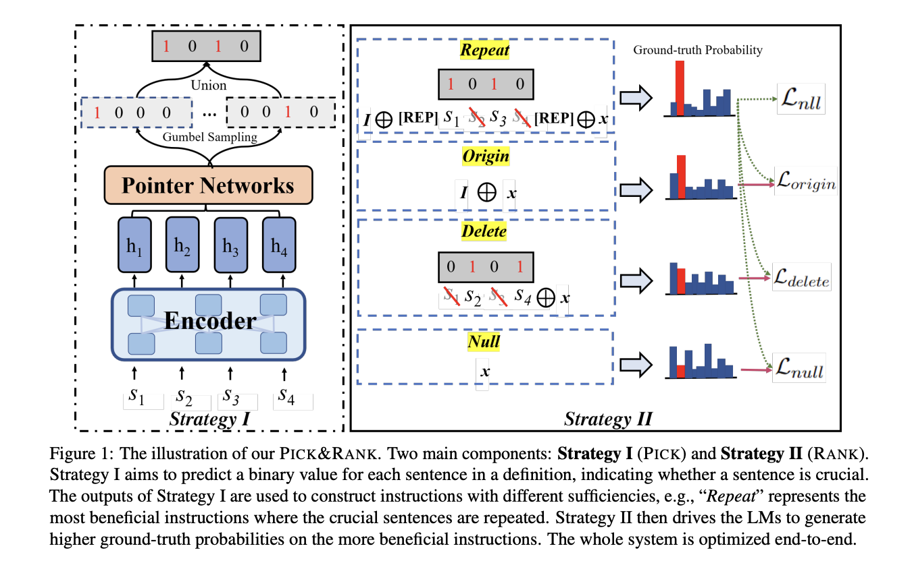

This repository contains the code for the paper "[*Forget Demonstrations, Focus on Learning from Textual Instructions*](https://arxiv.org/abs/2308.03795)".

We use pointer network to pick up several critical sentences from the task definition, and then utilize an additional training objective (i.e., ranking loss) to train the text-to-text language model.

[](https://arxiv.org/abs/2308.03795)

The main system requirements:
- Python == 3.8.0
- Pytorch == 1.12.1
- Transformers == 4.18.0
- CUDA == 11.3

## Environment Setup 

Please run the following script to setup the conda environment:

```bash
sh setup_env.sh
```

You can further use `conda activate pick_rank` to activate the environment. 

## Data Preparation

We use the [Super-NaturalInstructions](https://arxiv.org/abs/2204.07705) for the experiments. Please download the dataset by running:

```bash
git clone git@github.com:allenai/natural-instructions.git data
```

Since there is no official development set in the Super-NaturalInstructions, we randomly select 100 tasks from the "excluded" set as the development set, a maximum of 100 instances per task, to tune the hyper-parameters. Please use the following script to process and split the data:

```bash
sh setup_data.sh
```

The data split information can be found in `data/splits/add_dev`, and the processed data can be found in `data/tasks/def_segmentation`. You can use the following script to print the data statistics:

```bash
python data_statistics.py
```

## Experiments

We use the [Hugging Face T5-base](https://huggingface.co/t5-base) for all our experiments and analysis. You can use the following script to train the model:

```bash
sh scripts/run.sh
```

The results can be found in `output`, including the saved model files, the predictions, and all the intermediate results. 

You can also use the following script to quickly read and print the evaluation scores on the test set:

```bash
python read_results.py
```

<!-- It is worth noting that, we follow the previous work randomly selecting 100 instances from each training task, the model performances can be varied due to the randomness in the training instances. -->

## Citation

Please cite this paper if you use any scores or scripts of this repository:

```bibtex
@article{lou2023forget,
  title={Forget demonstrations, focus on learning from textual instructions},
  author={Lou, Renze and Yin, Wenpeng},
  journal={arXiv preprint arXiv:2308.03795},
  year={2023}
}
```